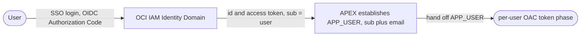

# 1-login - SSO login logic (login phase)

Adds **SSO sign-in** to an APEX app that calls an AIDP agent, so after login the app holds a
**trustworthy end-user identity** (`:APP_USER` = the `sub` claim, plus `email`). That identity
is the input the per-user OAC token phase (`../2-per-user-oac-token/`) uses to mint the token.

## Prerequisites

- An APEX workspace (developer login) on an Autonomous Database (ADB).
- Rights to create a **Confidential Application** in an OCI IAM Identity Domain (often
  admin-gated - line this up early).
- The domain's discovery URL: `https://<IDENTITY_DOMAIN_HOST>/.well-known/openid-configuration`.
- Your ADB APEX host, to build the redirect URI.

## Flow

## Steps

| Step | File |
|------|------|
| 1 | [setup/1-identity-domain-confidential-app.md](setup/1-identity-domain-confidential-app.md) - create the login app + redirect URI |
| 2 | [setup/2-apex-web-credential.md](setup/2-apex-web-credential.md) - store client id/secret |
| 3 | [setup/3-apex-social-signin-scheme.md](setup/3-apex-social-signin-scheme.md) - the Social Sign-In auth scheme |
| 4 | [setup/4-verify-login.md](setup/4-verify-login.md) - verify + what `:APP_USER` should show |

## Handoff

After login, `:APP_USER` holds the end user's `sub`. The per-user auth phase calls
`mint_*_token(:APP_USER)` to produce an OBO token whose subject is that same user. This phase
stops at establishing `:APP_USER`.
